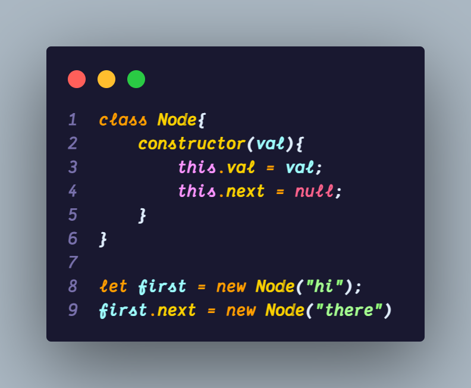
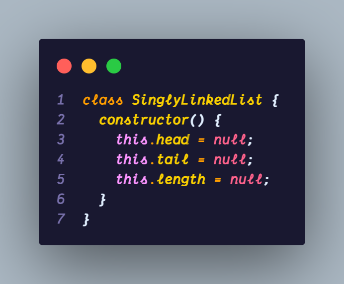
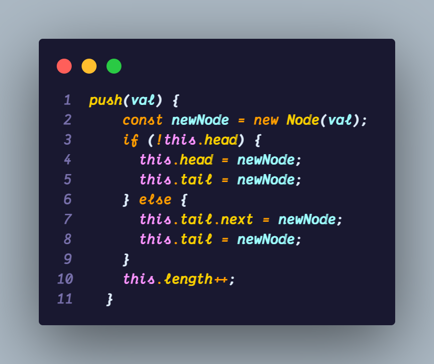
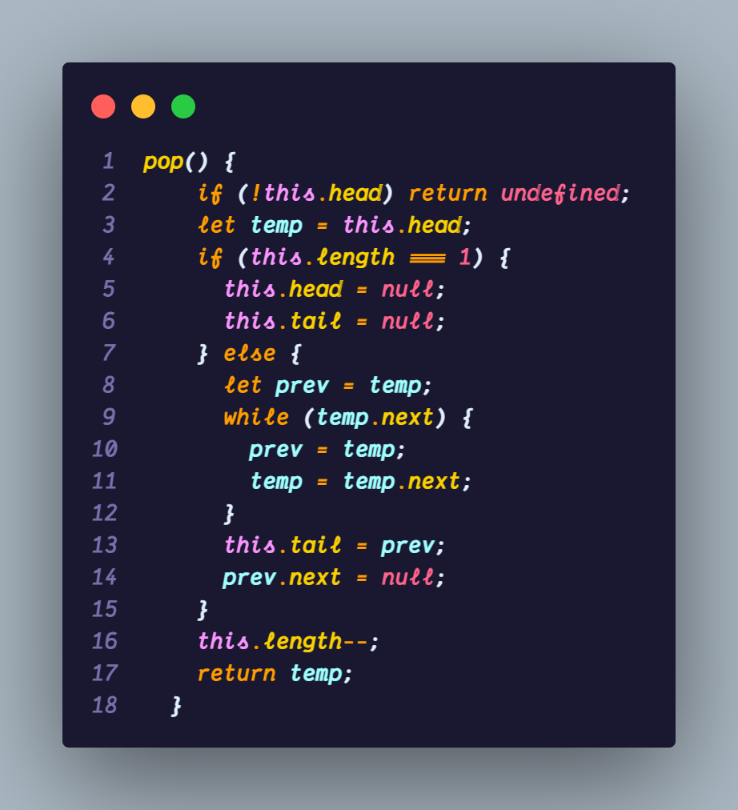

# Singly LinkedLists

A repo containing all the Singly LinkedLists code!

## Appendix

All the implementations are done using **Javascript**. why? cause it's the most **loved** and most **hated** language in the whole coding community. I **choose** to stick with it!

## Authors

- [@Aryadev](https://github.com/Aryadev19)

## Objectives

- Define what a Singly Linked List is
- Compare and cntrast Linked List with Arrays
- Implement Insertion,removal and traversal methods on Singly Linked Lists

### What is a linked list ?

- A list of data like an array. But instead of indices linkedlists, is a data structure that contains a **head, tail and length** property.
- Linked list consist of nodes, and each **node** has a **value** and **pointer** to another node or null.
  

- Question :- Why use Linked Lists when there is already arrays are available?
- Ans:- well tell you what adding or removing item from the start of an array takes **O(N)** time, because it has to reindex all the items present in the array, for example if we add one item in the beginning then we have to increment indices of rest of the elements by 1. Where in LinkedLIst it only take **O(1)** time.

### How we are naming things ?

We are using `val` for the piece of the data and `next` for the reference to the next node.

## Implementation

- This is how we write the node class method

  

- As we said before a Linked list class contains a head, tail and length property, so we are gonna now implement the SingleLinkedList class method

- This is how we initiate it.

  

### **Pushing**

- The push method add element in the end of the linked list

### Push Pseudocode

- This function should accept a value
- Create a new node using the value passed to the function
- If there is no head property on the list, set the head and tail to be the newly created node
- Otherwise set the next property on the tail to be the new node and set the tail property on the list to be the newly created node
- Increment the length
- Return the whole list

### The code implementation

### **Popping**

- Popping removes an element from the end.

### Pop Pseudocode

- if there are no nodes in hte list, return undefined
- Loop through the list until you reach the tail
- Set the next property of the 2nd to last node to be null
- Set the tail to be the 2nd to last node
- Decrement the length of the list by 1
- return the value of the node removed.

### The code implementation

