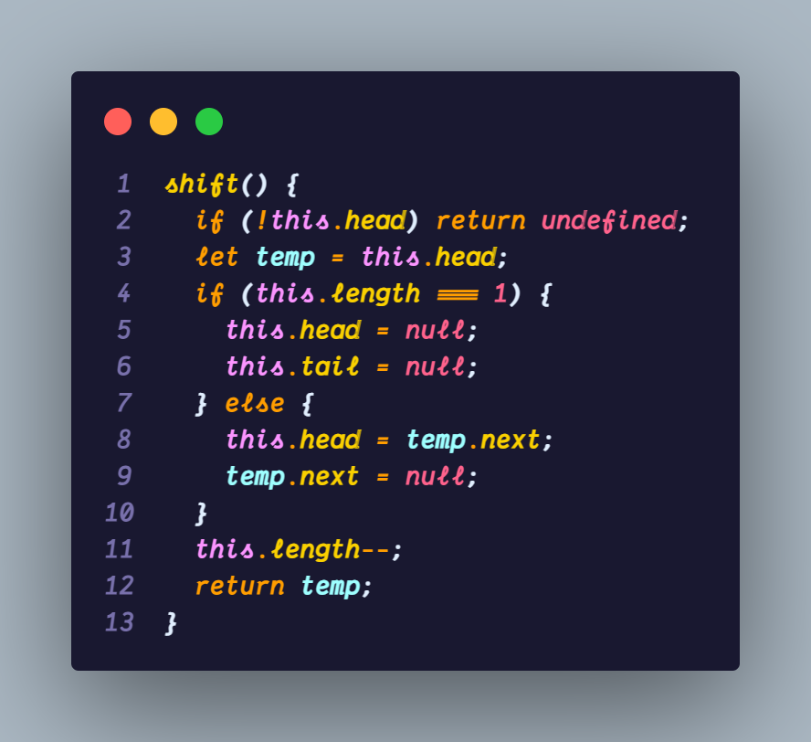
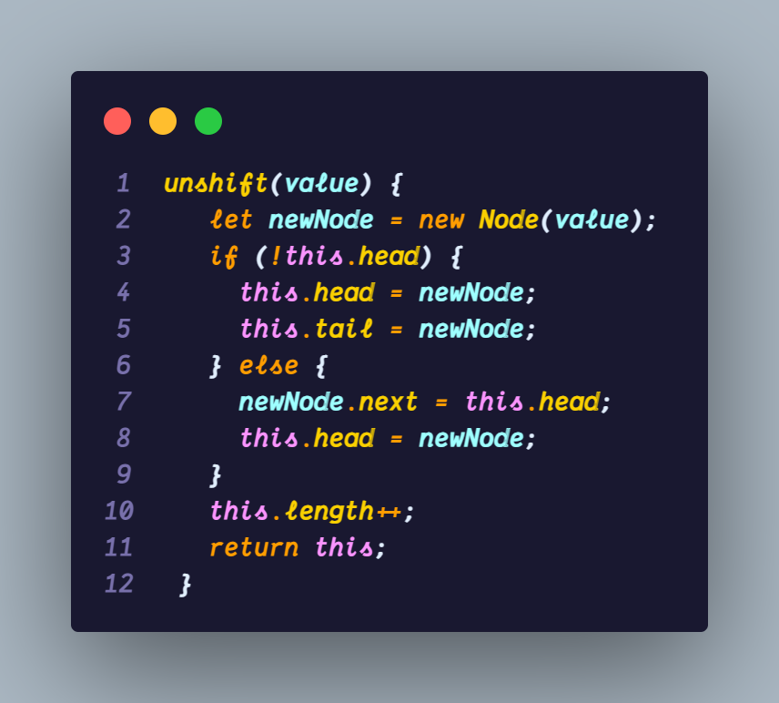
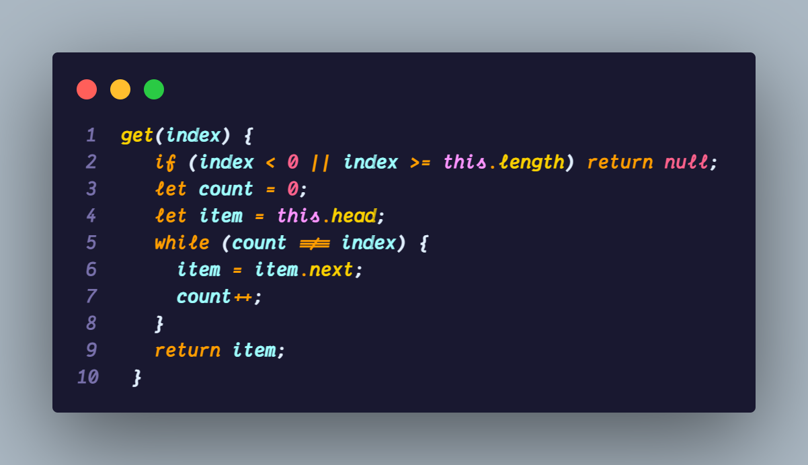
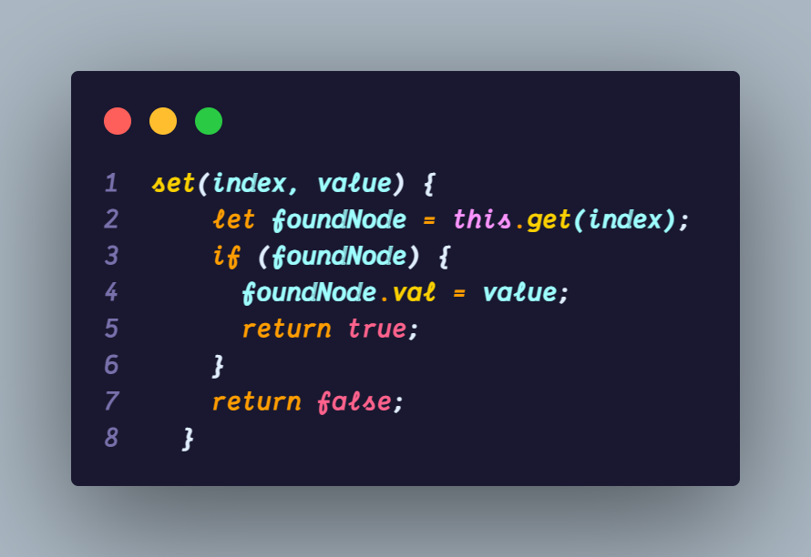
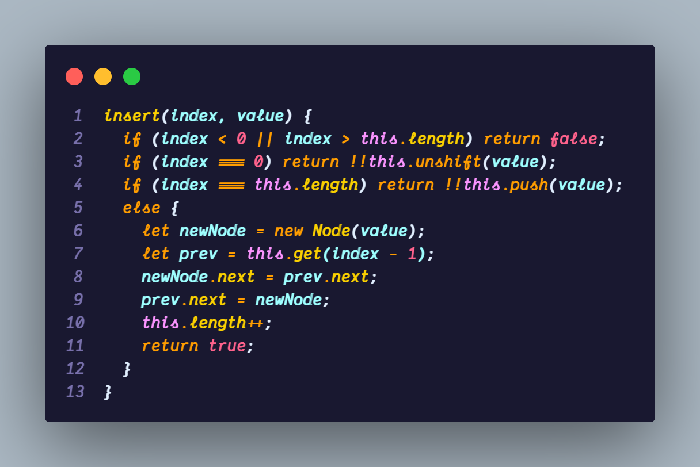
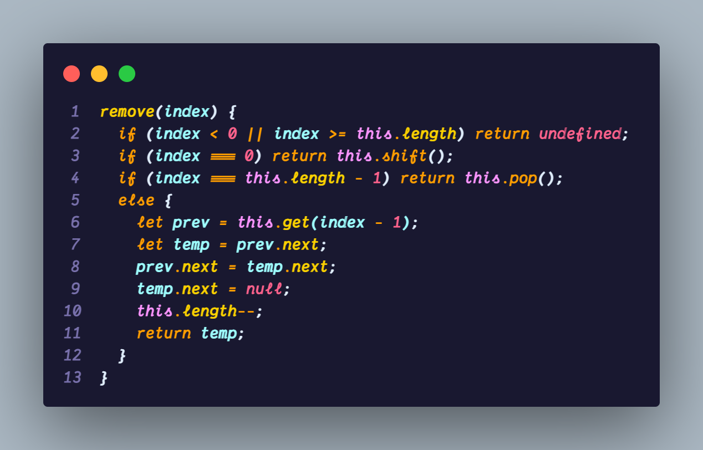
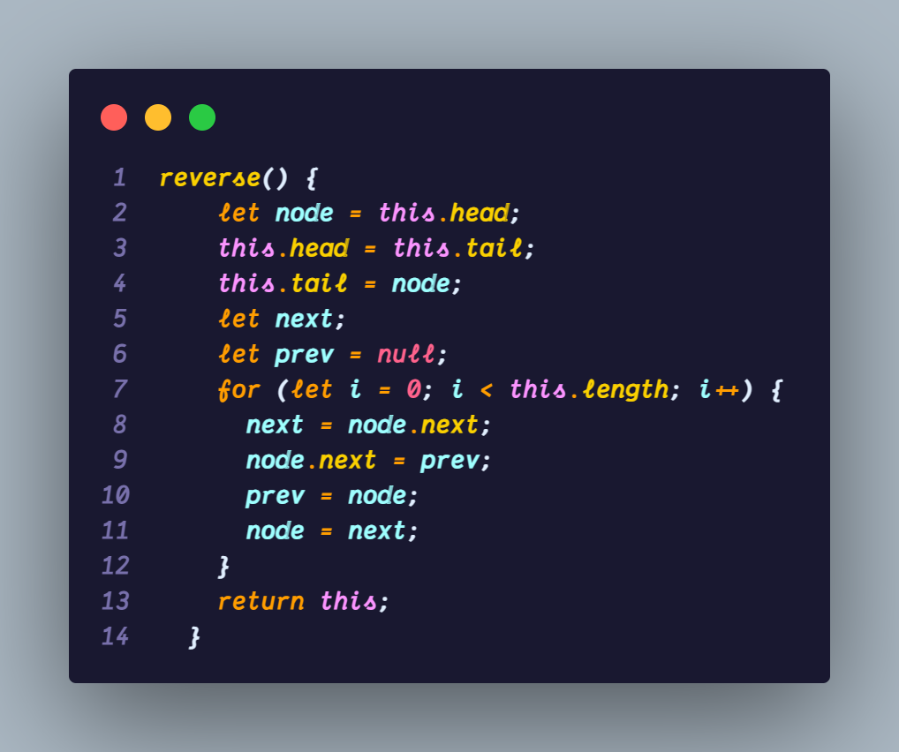

# Singly LinkedLists

A repo containing all the Singly LinkedLists code!

## Appendix

All the implementations are done using **Javascript**. why? cause it's the most **loved** and most **hated** language in the whole coding community. I **choose** to stick with it!

## Authors

- [@Aryadev](https://github.com/Aryadev19)

## Objectives

- Define what a Singly Linked List is
- Compare and cntrast Linked List with Arrays
- Implement Insertion,removal and traversal methods on Singly Linked Lists

### What is a linked list ?

- A list of data like an array. But instead of indices linkedlists, is a data structure that contains a **head, tail and length** property.
- Linked list consist of nodes, and each **node** has a **value** and **pointer** to another node or null.
  

- Question :- Why use Linked Lists when there is already arrays are available?
- Ans:- well tell you what adding or removing item from the start of an array takes **O(N)** time, because it has to reindex all the items present in the array, for example if we add one item in the beginning then we have to increment indices of rest of the elements by 1. Where in LinkedLIst it only take **O(1)** time.

### How we are naming things ?

We are using `val` for the piece of the data and `next` for the reference to the next node.

## Implementation

- This is how we write the node class method

  

- As we said before a Linked list class contains a head, tail and length property, so we are gonna now implement the SingleLinkedList class method

- This is how we initiate it.

  

### **Pushing**

- The push method add element in the end of the linked list

### Push Pseudocode

- This function should accept a value
- Create a new node using the value passed to the function
- If there is no head property on the list, set the head and tail to be the newly created node
- Otherwise set the next property on the tail to be the new node and set the tail property on the list to be the newly created node
- Increment the length of the list by 1
- Return the whole list

### The code implementation

### **Popping**

- Popping removes an element from the end.

### Pop Pseudocode

- if there are no nodes in hte list, return undefined
- Loop through the list until you reach the tail
- Set the next property of the 2nd to last node to be null
- Set the tail to be the 2nd to last node
- Decrement the length of the list by 1
- return the value of the node removed.

### The code implementation

### **Shifting**

- Remove the first element from the list

### Shift Pseudocode

- If there are no nodes, return undefined
- Store the current head property in a variable
- Set the head property to be the current head's next property
- Decrement the length by 1
- Return the value of the node removed

### The code implementation

### **Unshifting**

- Add a new **node** at the beginning of the list.

### Unshift Pseudocode

- This function should accept a value
- Create a new node using the value passed to the function
- If there is no head property on the list, set the head and tail to be the newly created node
- Otherwise set the newly created node's next property to be the current head property on the list
- Set the head property on the list to be that newly created node
- Increment the length of the list by 1
- Return the linked list

### The code implementation

### Get

- To retrieve an element from the list

### Get pseudocode

- This function should accept an index
- If the index is less than zero or greater than or equal to the length of the list, return null
- Loop through the list until you reach the index and return the node at that specific index

### The code implementation

### Set

- Changing the value of a node based on it's position in the LinkedList

### Set pseudocode

- The function should accept a value and an index
- Use your get function to find the specific node.
- If the node is not found, return false
- If the node is found, set the value of that node to be the value passed to the function and return true

### The code implementation

### Insert

- insert an node at a given position in the list

### Insert pseudocode

- If the index is less than zero or greater than the length, return false
- If the index is the same as the length push a new node to the end of the list
- If the index is 0 then unshift a new node to the start of the list
- Use the get method to access the node at index-1
- set the next property on that node to be the new node
- set the next property of the newNode to be the previous next node
- Increment the length by 1
- return true

### The code implementation

### Remove

- Removing a node from a specific position of the list

### Remove pseudocode

- If the index is less than zero or greater than the length, return undefined
- If the index is the same as the length -1,pop
- If the index is 0, shift
- Otherwise, using the get method, access the node at the index-1
- Set the next property on that node to be the next of the next node
- Decrement the length by 1
- Return the value of the node removed

### Code implementation

### Reverse

- Reverse the linked list

### Reverse pseudocode

- Swap the head and tail
- Create a variable called next
- Create a variable called prev
- Create a variable called node and initialize it to the head property
- Loop through the list
- Set next to be the next property on whatever node is
- Set the next property on the node to be whatever prev node is
- Set prev to be the value of the node variable
- Set the node variable to be the value of the next variable
- Return the reversed list

### Code implementation

### That's it fellas it's over!
